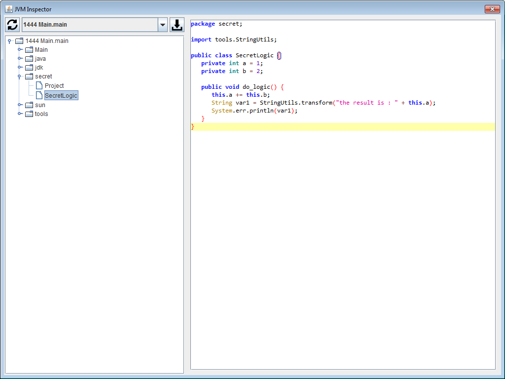

Attach to a running JVM and browse loaded classes

#### Dependencies

* JDK libraries (sa-jdi.jar, tools.jar) to dump bytecode
* [Fernflower](https://github.com/fesh0r/fernflower) to decompile bytecode into java code
* [RSyntaxTextArea](https://github.com/bobbylight/RSyntaxTextArea) to display java source code

